# Machine Learning Homework (Supervised and Unsupervised)

## Part 1: Supervised Learning
### Running instructions
- This python script predicts z values from input attributes x and y using a pre-trained Polynomial Ridge Regression model.
- **Dependencies**: copy and paste the following command if these libraries are not already installed in your env:
  ```bash
  pip install scikit-learn numpy pandas
- **Steps**:
  1. Make sure `x.csv`, `y.csv` files are in the root directory, the submission zip will provide `trained_model_best.pkl` and the prediction script
  2. Run the prediction script:
     ```bash
     python3 supervised_learning.py
  3. The predicted z values from the model will be output to `z-predicted.csv`, nothing else will be output
 
### Parameters and architecture
For my final model, I chose to use Polynomial Ridge regression using the python scikit-learn library. I use a polynomial degree of 3, with a ridge alpha value of 25.0. The model is trained on 5 random restarts in a for loop which changes the random seed value on each restart to account for variability in the split. My training splits were %80 training data and %20 testing data. The best model was chosen based on the lowest test mean squared error (MSE) across restarts. Here's the snippet from my train_model.py script
```
x = pd.read_csv('data/x.csv', header=None).values.flatten()  # .values.flatten => shapes as n rows
y = pd.read_csv('data/y.csv', header=None).values.flatten()
z = pd.read_csv('data/z.csv', header=None).values.flatten()

X = np.column_stack((x, y))  # combine x and y into the feature matrix 'X' (n, 2)

# training splits: 80% training, 20% test
#5 random restarts with different train-test splits
n_restarts = 5
alpha_constant = 25.0
best_mse = float('inf') #value
best_restart = 0 #index

for restart in range(n_restarts):
    print(f"random restart {restart + 1}/{n_restarts}")

    #split data: 80% training, 20% test with a different random seed
    X_train, X_test, z_train, z_test = train_test_split(X, z, test_size=0.2, random_state=42 + restart)
```

### Justification
To start, I wanted to display x and y against z to see what kind of data I was handling. The csv files were 50 columns on 1 row of varying values, so I used pandas to read the csv files and then sort sort x and y into matrix 'X' as 50x2 with numpys column stack. Scikit’s regression models, including Ridge, expect the input features to be in a 2D array of shape (N samples, N features), which is why I needed to reformat the data using pandas and numpy. I created `xy.py` to simply visualize x and y against z
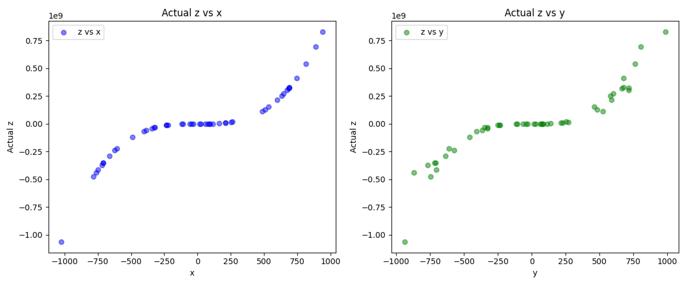   
Once I had this, I knew I had enough evidence to go with polynomial regression, but to explain, these graphs clearly follow a cubic function which is indicative of a non-linear relationship in the data. Therefore, I could eliminate linear regression, which relies on linear relationships, leaving me with Support Vector Regression (SVR), Neural Networks, and Decision Trees as my alternative methods for choice. 
- SVR: I didn't want to do SVR because it requires tuning multiple hyperparameters (C, epsilon, kernel parameters), which is challenging with only 50 samples. Polynomial regression directly targets the cubic form and is just simpler to implement and interpret given how clearly the data represents a cubic function. If there was a larger amount of noise in the data, I would have likely chosen SVR over PolyRidge.
- Neural Network: Similarily to SVR, Neural networks are powerful for nonlinear relationships, but require larger datasets to avoid overfitting. With only 50 samples, they would likely overfit and require lots of tuning and computational resources, which I think makes it impractical here.
- Decision Trees: Decision trees are non-parametric and can overfit noisy data by creating overly complex splits. Polynomial Ridge Regression offers a parametric solution with regularization to handle noise.
- **Overall**: With how simple the graph looked and the small amount of noise present, polynomial regression appeared as the obvious choice because it would be the simplest to implement and I could also combine it with ridge regresion to account for the smaller amount of noise present to better predict a generalized solution. The other options would have been overcomplicated or impractical given the proof we have from the x, y , and z csv files.

To further prove why I believe my method is the best, I created `generate_samples.py` to create my own synthetic data that follows a similar formula that the provided csv files seem to follow. This time it's 100 samples and the noise factor is much larger. Here is an example of the synthetic data I generated. followed by my PolyRidge model predicting z on it:
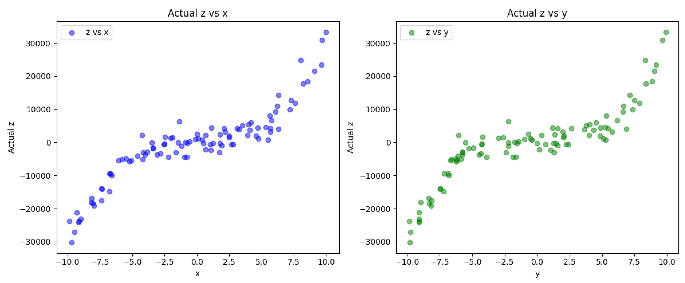 
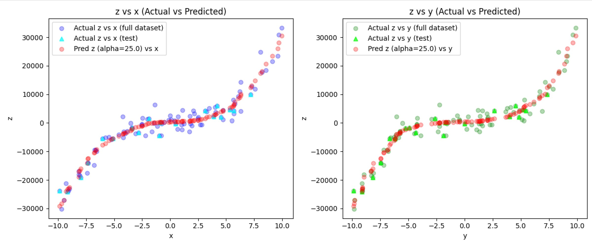 


- The red dots, representing predicted z values, uncover the function super well with almost no overfitting to the noise. I compared the predicted z values with the actual synthetic z values (test set only) and we can see that we have a great balance in between overfitting (exactly on the Ideal Fit line) and underfitting (scattered red dots everywhere)
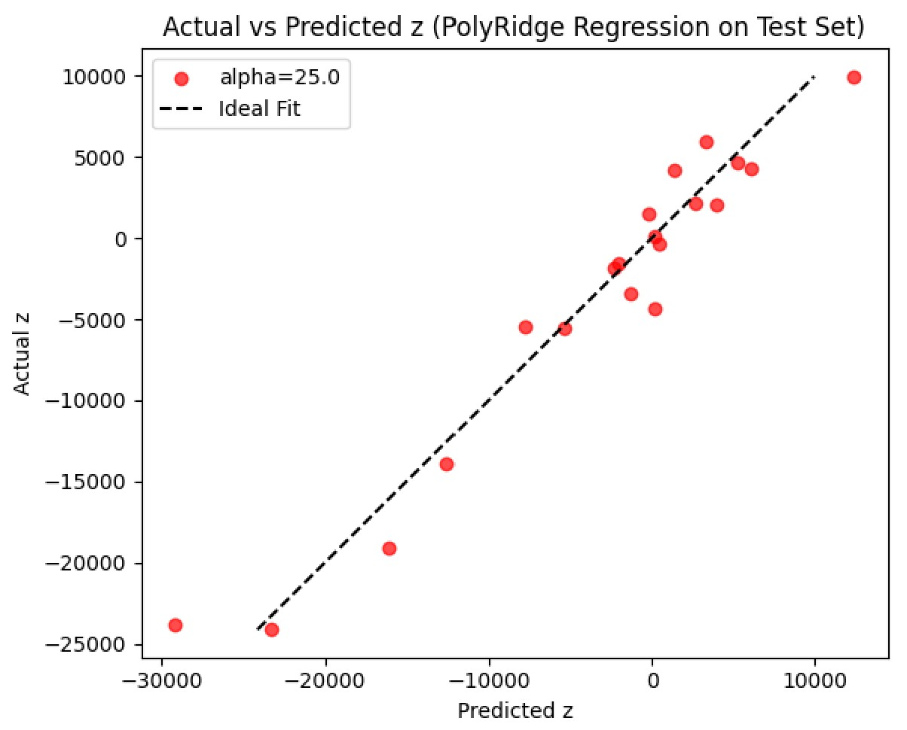 

### Trade offs: model complexity and empirical loss
Using degree 3 polynomials generates 10 features (1, x, y, x^2, xy, y^2, x^3, x^2 y, xy^2, y^3), so for only 50 samples, this can pose a moderate risk of overfitting without regularization. The more features and complexity, the higher the risk of overfitting, and vice versa for underfitting.  

To demonstrate what would happen if I did not use any regularization, I can set the alpha value to 0 in my ridge regression model. In ridge regression, the alpha constant is a non-negative float parameter that multiplies the L2 term and controls the regularization strength. A higher alpha value penalizes noise, and an alpha value of 0 is equivalent to linear regression. Here's an example of polynomial regression where the regressor is linear regression (alpha=0.0):
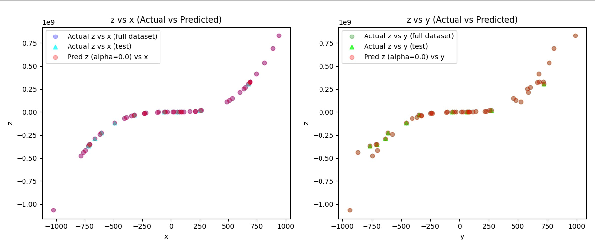
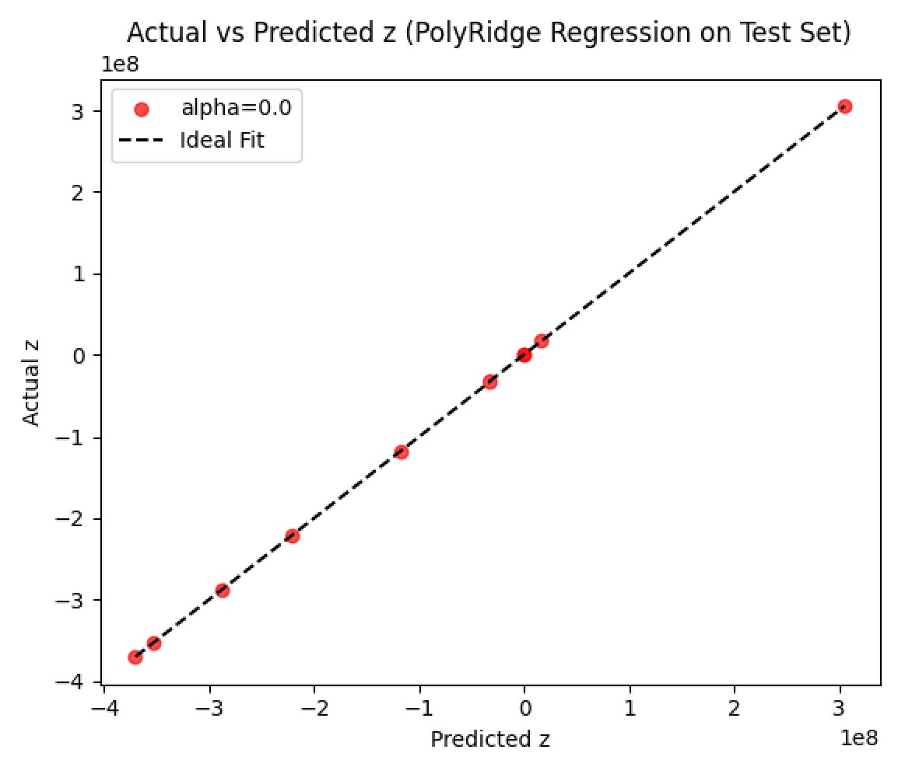


- We can see every predicted z value aligns exactly with every single actual z value, which means the model has completely overfit to the training data. This is where ridge regression becomes useful. To find the best alpha constant to apply, I ran multiple tests with varying alphas [10, 25, 100, 1000]
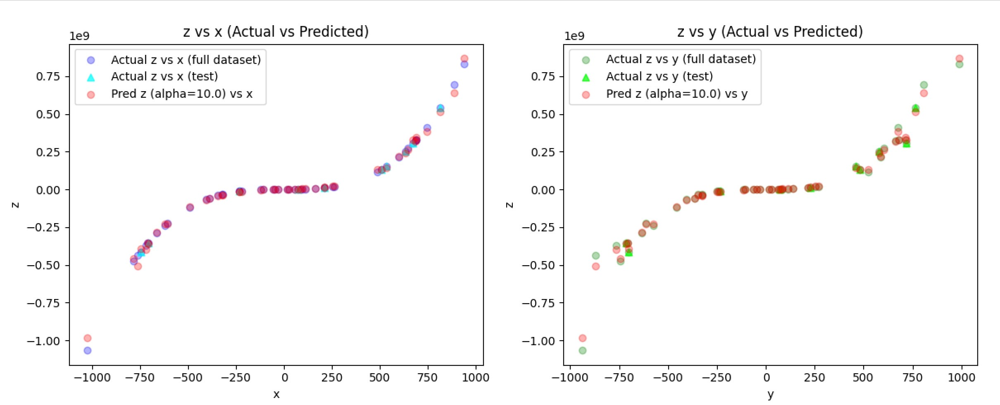
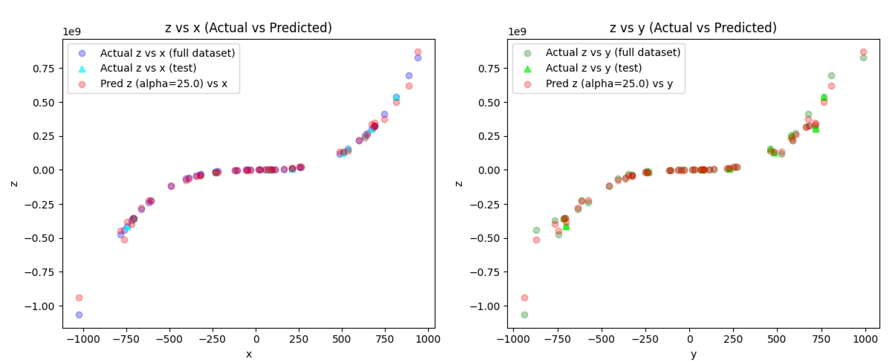
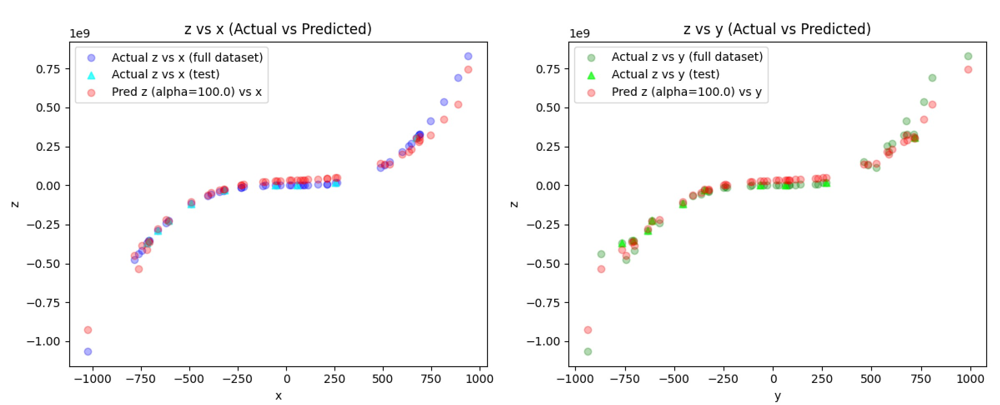
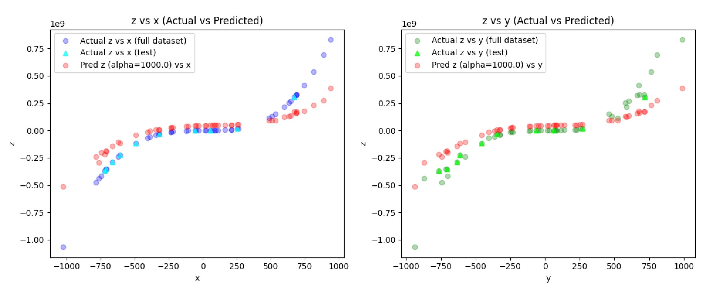


- Based on my observations, I found the regularization became too strong at 100 and after, while 10 and under were risking overfitting too much. I determined that 25 was an appropriate sweet spot and so chose it for my final model.

  
### Empirical Loss
Here were the results during my testing in search for the best alpha constant. Again, of the 5 restarts for each alpha constant, I selected the model which had the lowest MSE.
- alpha=0: Test MSE ≈ 68,872,024.60 (linear regression), severe overfitting.
- alpha=10: Test MSE ≈ 203,353,223,240,804.28, slight overfitting.
- alpha=25: Test MSE ≈ 388,901,150,554,052.75, balanced fit.
- alpha=100: Test MSE ≈ 504,434,749,919,926.2, slight underfitting.
- alpha=1000: Test MSE ≈ 1.1392588241442616e+16 , severe underfitting.

Yes, these are extreme values. This is mainly due to the fact of the massive scaling difference between x, y and z and the polynomial functin being applied in the data. It's also why I chose to implement StandardScalar in my training script to be able to predict on a scaled set of data and then unscale for the final predictions to match the original scale of z. So while the linear regressor had the lowest MSE out of all the models I trained, that doesn't necessarily mean it was the best fit. This is the case for a lot of models; the lowest MSE is not the 'best' MSE. 

Therefore, after many tests, I landed on PolyRidge regression with an alpha constant of 25.0. Here was the final Predicted z vs Actual z graph of my final model choice. The model picks up the function very well. It appears to be a slight overfit, but I believe it's mostly because of the limited noise and sample size. I confirmed my assumptions with the synthetic data examples I provided in my Justification section.
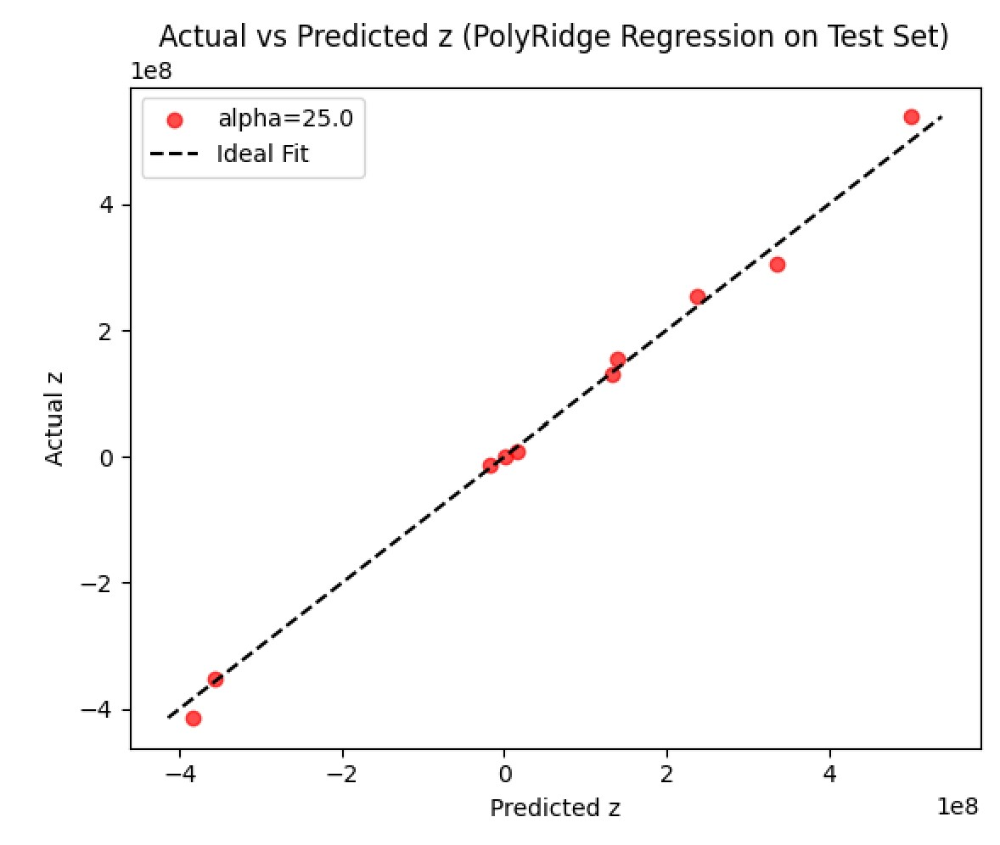


